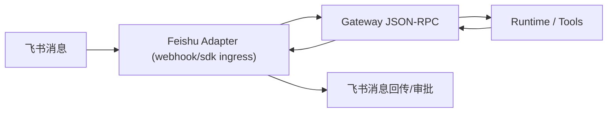

# 飞书接入配置指南

本文覆盖两种接入模式：

- `webhook`：适合云端部署，需要公网 HTTPS 回调；
- `sdk`：适合本地个人/演示，使用飞书 SDK 长连接接收事件，不需要 ngrok。

## 1. 链路说明



Adapter 与 Gateway 之间始终复用同一条链路：
`authenticate -> bindStream -> run -> gateway.event`。

## 2. 必备字段

至少准备：

1. `app_id`
2. `app_secret`

Webhook 模式额外需要：

3. `verify_token`
4. `signing_secret`

## 3. 配置示例

写入 `~/.neocode/config.yaml`：

```yaml
feishu:
  enabled: true
  ingress: "sdk" # webhook | sdk
  app_id: "cli_xxx"
  app_secret: "xxx"
  # 群聊 @ 命中建议至少配置一个
  bot_user_id: "ou_xxx"
  bot_open_id: "ou_xxx"

  # 仅 webhook 必填
  verify_token: "xxx"
  signing_secret: "xxx"
  insecure_skip_signature_verify: false

  adapter:
    listen: "127.0.0.1:19080" # 仅 webhook 使用
    event_path: "/feishu/events"
    card_path: "/feishu/cards"

  request_timeout_sec: 8
  idempotency_ttl_sec: 600
  reconnect_backoff_min_ms: 500
  reconnect_backoff_max_ms: 10000
  rebind_interval_sec: 15

  gateway:
    listen: "\\\\.\\pipe\\neocode-gateway-feishu"
    token_file: ""
```

## 4. 启动命令

先启动 Gateway：

```powershell
go run ./cmd/neocode-gateway --listen "\\.\pipe\neocode-gateway-feishu" --http-listen 127.0.0.1:18181
```

### 4.1 本地无公网（推荐个人调试）

```powershell
go run ./cmd/neocode feishu-adapter --ingress sdk --gateway-listen "\\.\pipe\neocode-gateway-feishu"
```

这个模式不需要配置飞书回调 URL。

### 4.2 公网回调（云端或联调）

```powershell
go run ./cmd/neocode feishu-adapter --ingress webhook --gateway-listen "\\.\pipe\neocode-gateway-feishu" --listen 127.0.0.1:19080
```

然后把 `19080` 暴露公网并在飞书后台配置：

- 事件回调：`https://<domain>/feishu/events`
- 卡片回调：`https://<domain>/feishu/cards`

## 5. 行为与边界

- 私聊默认受理；
- 群聊必须 `@` 当前 bot 才触发执行；
- 默认只回传关键状态：受理、权限请求、完成、失败；
- SDK 模式下审批优先走事件回调；若租户侧不可用，可使用文本审批降级：
  - `允许 <request_id>`
  - `拒绝 <request_id>`

## 6. 常见问题

### `signing_secret is required ...`

你当前在 `webhook` 模式但未配置 `signing_secret`。  
解决：补齐密钥，或切换 `ingress: sdk`。

### `workspace hash is empty and no default configured`

Gateway 没有可用工作区。  
解决：在本机会话里设置有效 workdir 后再触发 run。

## 7. 与 #555 的关系

- #557：只新增 SDK 入站，让 Adapter 本机可用、无需公网；
- #555：云端控制面路由到用户本机 Runner 的远程执行通道（后续能力）。
