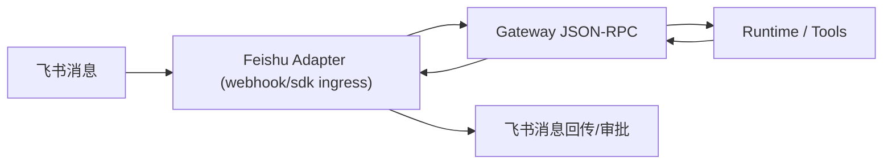

# 飞书接入配置指南

这份文档面向**用户实际可用**场景，先给你最推荐的本地模式：

- `sdk`（推荐）：本机长连接，不需要公网地址、不需要 ngrok；
- `webhook`：云端/联调模式，需要公网 HTTPS 回调。

## 0. 你将得到什么

配置完成后，你可以在飞书里直接给 NeoCode 机器人发消息，消息会路由到你本机 Gateway 执行，再把结果回传飞书聊天窗口。

核心链路：

```text
飞书消息 -> Feishu Adapter(SDK长连接) -> 本机 Gateway -> Runtime/Tools -> 飞书回传
```

## 1. 前置准备

你需要先准备：

1. 飞书应用 `app_id` / `app_secret`
2. 本机已能运行 NeoCode 源码（或已安装二进制）
3. 本机有可用工作区路径（例如 `F:\Qiniu\neo-code`）

说明：

- SDK 模式下，`verify_token`、`signing_secret`、公网回调 URL 不是必需条件；
- 这些字段留在配置里不影响运行，但不会用于 SDK 入站。

## 2. 配置 `~/.neocode/config.yaml`（SDK 推荐模板）

把下面配置写入 `~/.neocode/config.yaml`（Windows 通常是 `C:\Users\<你>\.neocode\config.yaml`）：



```yaml
feishu:
  enabled: true
  ingress: "sdk" # webhook | sdk（个人开发推荐 sdk）
  app_id: "cli_xxx"
  app_secret: "cli_secret_xxx"

  # 群聊 @ 命中建议至少配置一个（没有时私聊仍可用）
  bot_user_id: "ou_xxx"
  bot_open_id: "ou_xxx" 

  # 以下字段仅 webhook 需要；sdk 模式可留空
  verify_token: "xxx"
  signing_secret: "xxx"
  insecure_skip_signature_verify: false

  adapter:
    listen: "127.0.0.1:19080" # 仅 webhook 使用
    event_path: "/feishu/events"
    card_path: "/feishu/cards"

  request_timeout_sec: 8
  idempotency_ttl_sec: 600
  reconnect_backoff_min_ms: 500
  reconnect_backoff_max_ms: 10000
  rebind_interval_sec: 15

  gateway:
    listen: "\\\\.\\pipe\\neocode-gateway-feishu-sdk"
    token_file: "C:/Users/<你>/.neocode/auth.json"
```

## 3. 启动命令（SDK 模式）

先启动 Gateway（建议显式带 `--workdir`，避免 workspace hash 为空）：

```powershell
go run ./cmd/neocode-gateway `
  --listen "\\.\pipe\neocode-gateway-feishu-sdk" `
  --http-listen 127.0.0.1:18181 `
  --workdir "F:\Qiniu\neo-code"
```

再启动 Adapter（SDK ingress）：

```powershell
go run ./cmd/neocode feishu-adapter `
  --ingress sdk `
  --gateway-listen "\\.\pipe\neocode-gateway-feishu-sdk"
```

判定成功的日志特征：

1. Gateway 日志出现 `gateway.authenticate`、`gateway.bindStream`、`gateway.run`
2. Adapter 日志出现 `connected to wss://msg-frontier.feishu.cn`

## 4. 飞书开放平台设置（SDK 模式）

在飞书开放平台中：

1. 打开你的应用，确保是机器人应用并已发布当前版本
2. 事件与回调页面选择：`使用长连接接收回调`
3. 订阅事件至少包含：`im.message.receive_v1`

SDK 模式下不需要填写公网请求地址，也不需要 ngrok。

## 5. 实测流程（你可以直接照做）

1. 在飞书私聊机器人发：`你好`
2. 预期先看到：`任务已受理，正在执行。`
3. 随后收到：任务完成或失败摘要

如果你要测群聊触发：

1. 把 `bot_user_id` 或 `bot_open_id` 配到 config
2. 在群里显式 @ 机器人后再发消息
3. @ 其他人不应触发 NeoCode 运行

## 6. 审批能力边界（SDK）

SDK 模式优先尝试卡片审批事件；如果租户/事件链路不支持卡片动作回流，可使用文本审批降级：

- `允许 <request_id>`
- `拒绝 <request_id>`

两者都会走 `gateway.resolvePermission`，不会绕过网关。

## 7. Webhook 模式（可选）

如果你要云端部署/公网联调，再切到 webhook：

```powershell
go run ./cmd/neocode feishu-adapter `
  --ingress webhook `
  --gateway-listen "\\.\pipe\neocode-gateway-feishu-sdk" `
  --listen 127.0.0.1:19080
```

然后把 `19080` 暴露公网并在飞书后台配置：

- 事件回调：`https://<domain>/feishu/events`
- 卡片回调：`https://<domain>/feishu/cards`

## 8. 常见问题

### `signing_secret is required ...`

你当前处于 `webhook` 模式但没配置签名密钥。  
解决：补齐密钥，或切换 `ingress: sdk`。

### `workspace hash is empty and no default configured`

Gateway 没有可用工作区。  
解决：启动 gateway 时加 `--workdir <你的项目路径>`。

### 飞书里只看到“已受理”，后续没响应

优先检查：

1. Gateway 是否仍在运行（管道名是否一致）
2. Adapter 是否仍连接到飞书长连接网关
3. 机器人是否有模型/API key 可用
4. run 是否被权限拦截（看 gateway 日志）

## 9. 与 #555 的关系

- #557：只新增 SDK 入站，让 Adapter 本机可用、无需公网；
- #555：云端控制面路由到用户本机 Runner 的远程执行通道（后续能力）。
