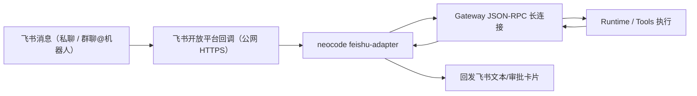

# 飞书远程接入配置指南

本文是 NeoCode 的飞书接入实操文档，目标是让你可以在飞书（含手机端）发消息，驱动 NeoCode 执行任务并回传结果。

当前实现（#554 Phase 1）采用 **飞书 Webhook 回调 + NeoCode Feishu Adapter 长连接 Gateway** 的模式。

## 1. 先理解这条链路



关键点：

- 飞书到 Adapter 这段必须是公网可访问的 HTTPS 回调地址。
- Adapter 到 Gateway 是本地/内网长连接，不需要暴露 Runtime 私有接口。
- 当前不是“飞书官方 SDK 长连接接收事件”模式；那是后续阶段（#555）目标。

## 2. 你需要准备的四个字段

在飞书开放平台应用里，你至少要拿到并回填这 4 个值：

1. `App ID` -> `feishu.app_id`
2. `App Secret` -> `feishu.app_secret`
3. `Verification Token` -> `feishu.verify_token`
4. `Signing Secret` -> `feishu.signing_secret`

说明：

- 代码默认要求签名校验开启：`signing_secret` 必填。
- 仅本地联调可设置 `feishu.insecure_skip_signature_verify: true` 临时跳过签名校验，不建议生产使用。
- 若飞书后台开启了“加密推送（Encrypt Key）”，请确认你的服务端支持解密。当前建议先用未加密模式完成联调。

## 3. 配置文件示例（完整可用）

把下面配置写入 `~/.neocode/config.yaml`（Windows 一般是 `C:\Users\<你>\.neocode\config.yaml`）：

```yaml
gateway:
  listen: "\\\\.\\pipe\\neocode-gateway-feishu"
  http_listen: "127.0.0.1:18181"

feishu:
  enabled: true
  app_id: "cli_xxx"
  app_secret: "xxx"
  verify_token: "xxx"
  signing_secret: "xxx"
  insecure_skip_signature_verify: false

  # 对外可访问的 HTTPS 前缀（ngrok/cloudflared 分配的地址）
  callback_base_url: "https://xxxx.ngrok-free.app"

  adapter:
    listen: "127.0.0.1:19080"
    event_path: "/feishu/events"
    card_path: "/feishu/cards"

  idempotency_ttl_sec: 600
  request_timeout_sec: 8
  reconnect_backoff_min_ms: 500
  reconnect_backoff_max_ms: 10000
  rebind_interval_sec: 15

  gateway:
    # adapter 连接 gateway 的地址（可用命名管道或 TCP）
    listen: "\\\\.\\pipe\\neocode-gateway-feishu"
    # 可选：网关 token 文件路径
    token_file: ""
```

如果你用纯 TCP（不用命名管道），把 `gateway.listen` 和 `feishu.gateway.listen` 改成 `127.0.0.1:<port>`。

## 4. 本地启动顺序

建议两个终端：

1) 启动 Gateway

```powershell
go run ./cmd/neocode-gateway --listen "\\.\pipe\neocode-gateway-feishu" --http-listen 127.0.0.1:18181
```

2) 启动 Feishu Adapter

```powershell
go run ./cmd/neocode feishu-adapter --gateway-listen "\\.\pipe\neocode-gateway-feishu" --listen 127.0.0.1:19080
```

看到 adapter 无报错并保持阻塞运行是正常状态。

## 5. 公网回调地址（ngrok 示例）

把本地 `19080` 暴露到公网：

```powershell
ngrok http 19080
```

假设拿到公网前缀：

```text
https://xxxx.ngrok-free.app
```

那么飞书回调地址应为：

- 事件回调：`https://xxxx.ngrok-free.app/feishu/events`
- 卡片回调：`https://xxxx.ngrok-free.app/feishu/cards`

## 6. 飞书后台怎么填

在飞书开放平台应用里：

1. 订阅方式选择“将回调发送至开发者服务器”。
2. 事件配置里添加机器人消息事件（如 `im.message.receive_v1`）。
3. 回调配置里填写：
   - 请求地址：`https://xxxx.ngrok-free.app/feishu/events`
   - 卡片回调请求地址：`https://xxxx.ngrok-free.app/feishu/cards`
4. 加密策略页确认 `Verification Token` 与你配置一致；`Signing Secret` 与本地配置一致。

如果页面提示“返回数据不是合法 JSON”，优先检查：

- URL 是否填错（events 和 cards 路径不要混）；
- adapter 是否正在监听对应端口；
- `verify_token` / `signing_secret` 是否一致；
- ngrok 是否转发到正确本地端口。

## 7. 实际收发行为说明

- 私聊：默认受理消息。
- 群聊：默认需要 `@机器人` 才触发执行。
- 成功触发后会先返回“任务已受理，正在执行”，随后回传最终结果。
- 审批事件会发卡片（允许一次 / 拒绝）。

## 8. 常见报错与处理

### 8.1 `signing_secret is required ...`

你开启了 `feishu.enabled: true` 但未配置签名密钥。  
处理：

- 推荐：补上 `feishu.signing_secret`。
- 仅联调：`feishu.insecure_skip_signature_verify: true`。

### 8.2 `workspace hash is empty and no default configured`

Gateway 运行时没有默认工作区。  
处理：

- 用带 `workdir` 的会话启动 NeoCode，或在配置里补默认工作区相关项。

### 8.3 `session id ... contains unsupported characters`

旧配置/旧分支仍在使用不兼容的 session_id 格式。  
处理：更新到当前实现并重启 gateway + adapter。

### 8.4 飞书里只看到“受理中”，看不到有效结果

先看 Gateway 日志是否出现 `run async failed`。常见是工作区、权限、Provider 配置问题，不是飞书回调问题。

## 9. 安全建议

- 不要把 `app_secret`、`signing_secret`、`verify_token` 提交到仓库。
- 生产环境不要开启 `insecure_skip_signature_verify`。
- 回调地址建议走专用域名与 HTTPS，配合最小权限网络策略。

## 10. 进一步阅读

- [配置指南](./configuration)
- [排障与常见问题](./troubleshooting)
- [Gateway 集成参考](/reference/gateway)
